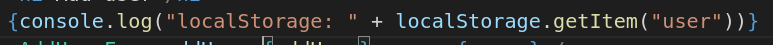
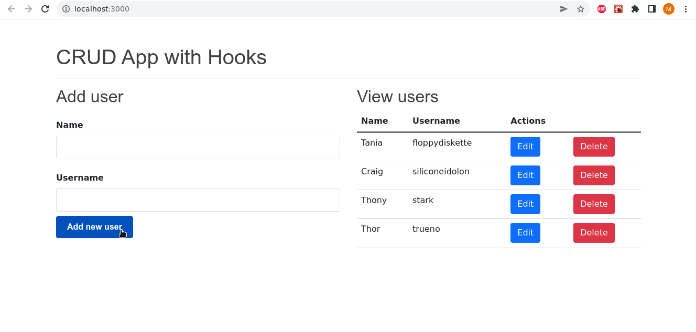
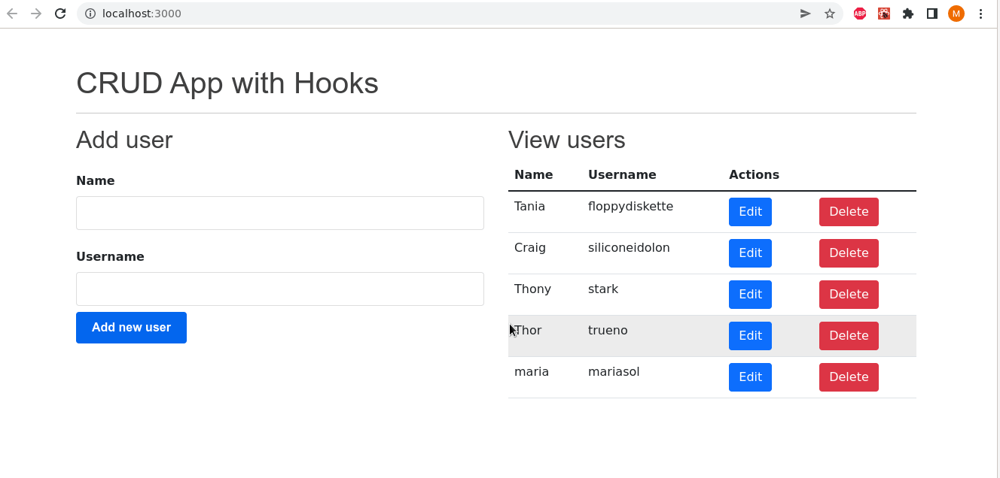

# CURSO-BASICO-REACT-CRUD

### A continuación se presentan las mejoras hechas al aplicativo:

#### 1) Se usa LocalStorage para almacenar los datos de manera local:

##### A continuación se imprime por consola los datos almacenados en el LocalStorage.

#### 2) Al momento de agregar un nuevo registro, se realiza la validación para que el username no se encuentre repetido

#### 3) Se agrega confirmación al momento en que el usuario hace la petición para eliminar un registro.

#### Aclaraciones de uso:

#### 1) Puedes usar el comando -> git clone https://github.com/Pilar89/CURSO-BASICO-REACT-CRUD.git para clonar el proyecto en tu equipo.
#### 2) Para instalar las dependencias, en el directorio del proyecto usa el comando -> npm install
#### 3) Para correr el proyecto -> npm run
#### 4) Abrir [http://localhost:3000] en el navegador, donde correrá el proyecto

